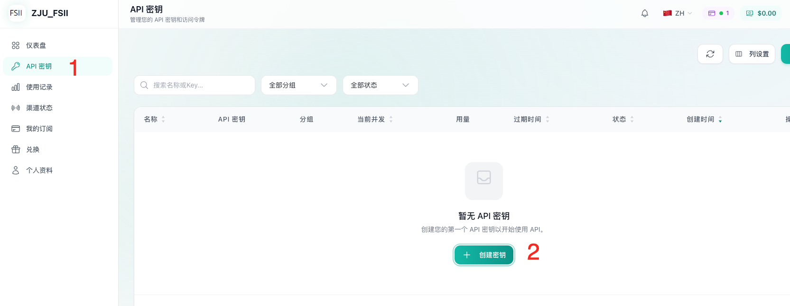
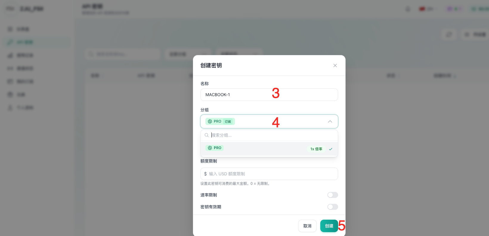
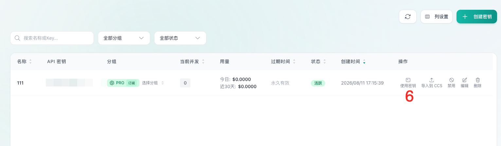

# FSII Codex 分发 API 订阅与配置指南

> 面向 FSII 实验室成员的 Codex 使用手册，用于指导大家从指定服务网站获取 API、完成订阅，并将 API 导入 Codex 进行配置和验证。

> [!IMPORTANT]
> **使用前请注意：本 API 无需代理即可正常使用。** 为避免网络环境混淆，请勿将本 API 与其他 AI 软件混合使用。使用其他 AI 软件时，请遵循对应服务的网络及账号使用要求，以免因未开启所需代理或网络环境异常导致其他账号受限或被封禁。

## 目录

- [1. 从网站获取 API](#1-从网站获取-api)
- [2. 将 API 订阅导入 Codex](#2-将-api-订阅导入-codex)
- [3. 验证配置](#3-验证配置)
- [4. 常见问题](#4-常见问题)
- [5. 其他提醒](#5-其他提醒)
- [6. 参考资料](#6-参考资料)
- [维护与反馈](#维护与反馈)

## 1. 从网站获取 API

### 1.1 登录网站

1. 打开实验室指定的 [API 服务网站](https://sub4zju.duyl328.org/)
 https://sub4zju.duyl328.org/
3. 使用分配的账号登录。
4. 进入控制台，确认账号状态正常。



### 1.2 创建 API 密钥

1. 在控制台中找到“API 密钥”页面。
2. 为自己的设备创建密钥。



> [!WARNING]
> - 不要截图传播完整密钥，也不要把密钥写入 README、代码、聊天记录或 Git 提交。
> - 不同网站的页面名称可能略有差异。若找不到对应入口，请联系仓库维护者或实验室管理员，不要自行购买未确认的套餐。

## 2. 将 API 订阅导入 Codex

### 2.1 选择 Codex 类型并导入

点击“导入密钥”，根据自己使用的 Codex 类型，按照页面指南完成配置。



### 2.2 配置字段说明

如需检查或手动调整配置，可参考以下字段：

| 字段 | 说明 |
| --- | --- |
| `model` | 服务商实际支持的模型 ID |
| `model_provider` | 自定义服务商标识，需要与服务商配置表名一致 |
| `base_url` | 服务商提供的 API Base URL |
| `env_key` | 保存 API Key 的环境变量名称 |
| `wire_api` | Codex 自定义服务商使用的接口协议 |

### 2.3 重启 Codex

保存配置后，完全退出并重新启动 Codex。若使用 Codex CLI，请关闭当前终端会话，并在已设置环境变量的终端中重新运行 `codex`。

## 3. 验证配置

打开一个不含敏感数据的测试项目，然后向 Codex 输入：

```text
请只读取当前项目，概括目录结构，不要修改任何文件。
```

如果 Codex 能正常返回结果，说明基础连接已经建立。随后可以让 Codex 执行一个小型、可撤销的任务，并检查其变更内容。

建议同时在 API 服务网站控制台确认：

- 是否产生了新的调用记录；
- 使用的模型是否正确；
- Token 消耗与余额是否正常；
- 是否出现认证失败、限流或接口错误。

## 4. 常见问题

### 4.1 提示未找到 API Key

- 确认环境变量名称与 `env_key` 完全一致；
- 确认 Codex 是从已设置该环境变量的终端启动；
- 修改环境变量后重新启动 Codex；
- 检查密钥前后是否混入空格、引号或换行。

### 4.2 出现 `401` 或 `403`

- API Key 可能错误、过期或已被撤销；
- 账号可能没有目标模型的访问权限；
- 订阅可能已到期或余额不足；
- Base URL 可能与服务商要求不一致。

### 4.3 出现 `404` 或模型不存在

- 检查 Base URL 是否缺少或重复了 `/v1`；
- 模型名称必须与服务商控制台显示的 ID 完全一致；
- 确认服务商接口兼容 Codex 当前要求的 Responses API。

### 4.4 出现 `429`

通常表示额度不足、请求过多或触发速率限制。请稍后重试，并在服务商控制台检查余额、并发数、RPM 和 TPM 限制。

### 4.5 Codex 可以启动，但请求一直失败

- 检查本机网络、代理和防火墙；
- 确认服务商状态页没有故障公告；
- 用一个最简单的只读任务重新测试；
- 保存去除密钥后的错误信息，再联系管理员。

## 5. 其他提醒

### 5.1 API 与账号安全

- API Key 原则上仅限本人使用，不得转发、公开或上传至网盘共享目录；
- 不要把 `.codex/auth.json`、密钥文件或包含密钥的终端截图提交到 GitHub；
- 一旦怀疑密钥泄露，应立即在服务网站撤销旧密钥并生成新密钥；
- 不要在来源不明的网站、脚本或插件中填写 API Key；
- 离开实验室、设备丢失或账号异常时，应及时联系管理员处理。

### 5.2 费用与额度

- API 调用通常按 Token 进行个人额度分配，如需紧急增加额度请联系管理员；
- 大文件、长对话、高推理强度和重复重试会增加消耗；
- 使用前确认余额和限额，避免在循环任务中产生意外费用；
- 不要将实验室 API 用于与科研、开发或教学无关的任务。

### 5.3 数据与科研合规

- 不要向第三方 API 上传未公开论文、个人信息、受试者数据、密钥或其他敏感材料；
- 涉及保密项目时，应先确认数据处理、留存和跨境传输政策；
- Codex 生成的代码和结论需要人工检查，不应未经验证直接用于生产、实验控制或论文结果；
- 使用 AI 辅助科研写作或编程时，应遵守实验室、学校、期刊和资助机构的披露要求。

### 5.4 配置与更新

- API 服务网站和 Codex 的配置方式可能更新，请以最新通知和官方文档为准；
- 修改配置前建议备份原有 `config.toml`；
- 不要直接复制他人的完整配置文件，其中可能包含个人路径、密钥或不适合你设备的权限设置。

## 6. 参考资料

- [Codex 配置参考](https://learn.chatgpt.com/docs/config-file/config-reference)
- [Codex 身份验证说明](https://learn.chatgpt.com/docs/auth)
- [Codex CLI](https://learn.chatgpt.com/docs/codex-cli)

## 维护与反馈

如果配置步骤、服务网站页面或模型名称发生变化，请提交 Issue 或 Pull Request。反馈错误时请提供：

- 操作系统与 Codex 版本；
- 已脱敏的相关配置；
- 完整错误信息；
- 可复现的操作步骤。

**请勿在 Issue、Pull Request、截图或日志中提交真实 API Key。**

---

本仓库是面向 FSII 实验室成员的内部使用指南，不隶属于 OpenAI，也不代表第三方 API 服务商。第三方接口的可用性、计费和数据处理政策由相应服务商负责。
